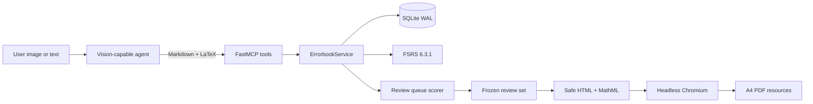

# Architecture

Errorbook MCP is a local-first Python service. The MCP adapter remains thin; durable behavior lives
in domain services that can be tested without an MCP client.

## Modules

| Module | Responsibility |
| --- | --- |
| `server.py` | MCP prompts, tools, resources, transport, and structured error mapping |
| `service.py` | Problem lifecycle, search, review events, priority events, and selection |
| `scheduler.py` | FSRS mapping, decays, retrievability, and explainable queue scoring |
| `db.py` | Versioned SQLite schema, WAL connections, and transaction helpers |
| `pdf_export.py` | Snapshot export, safe Markdown/MathML, browser rendering, and integrity checks |
| `schemas.py` | Strict Pydantic inputs and cross-field question validation |

## Durable model

- `problems` stores the current content and extracted FSRS fields.
- `problem_revisions` stores an immutable snapshot for each content version.
- `review_events` stores every outcome with before/after FSRS state and algorithm version.
- `priority_events` stores decaying user adjustments without rewriting review history.
- `review_sets` and `review_set_items` freeze the exact content selected for a worksheet.
- `exports` tracks rendering leases, paths, hashes, and terminal status.
- `idempotency_records` makes retries deterministic and rejects key reuse with different inputs.

Problem numbers are allocated from SQLite `AUTOINCREMENT` IDs and never change. Content updates use
an expected version. Review updates and idempotency records share one immediate write transaction.

## Scheduling and queueing

FSRS determines memory state and the next due time. Review-sheet selection is a separate layer that
combines due urgency, recent error pressure, FSRS difficulty, decaying manual boosts, and persistent
importance.

Recent errors have a 42-day half-life and manual boosts a 14-day half-life. Both are saturated before
scoring so old mistakes cannot dominate forever. Due problems not selected for 28 days enter a
fairness bucket before score-ranked candidates. Every selected item stores its score components and
reason codes for auditability.

## Export consistency

Selection first creates a frozen review set. Rendering then acquires a five-minute database lease.
PDF export is read-only: it does not update FSRS, queue priority, or selection state. Priority changes
come from explicit review outcomes or user priority adjustments.
An interrupted process can resume from the same snapshot after the lease expires by reusing the same
idempotency key.

Markdown raw HTML and external links are disabled. LaTeX is converted to static MathML, validated by
namespace and attribute allowlists, and rendered in a self-contained page with a restrictive CSP.
Published files are atomically replaced and verified as unencrypted A4 PDFs. Resource reads verify the
stored SHA-256 before returning bytes.

## Deployment boundary

The supported default is one local user over stdio. Remote streamable HTTP deployments require an
authenticating TLS reverse proxy and an ownership model outside this repository. The current database
schema is intentionally single-tenant.
